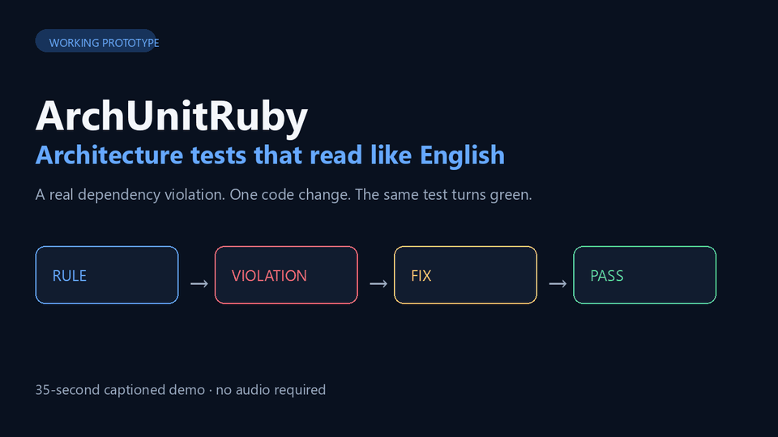

# Red-to-green architecture demo

This demo proves that ArchUnitRuby detects a real dependency violation and passes after the code is
fixed. It uses the RAG fixture's deliberately broken API shortcut:

[Download or play the 37-second MP4](archunitruby-red-green-demo.mp4).



```text
before: api -> retrieval      forbidden
after:  api -> services       allowed
```

Run the complete interactive walkthrough from the repository root:

```bash
bundle exec ruby demo/run_demo
```

The script performs three steps:

1. Runs the architecture spec and shows the two forbidden dependencies.
2. Replaces the shortcut with the service-layer implementation.
3. Runs the unchanged architecture test again and shows `1 example, 0 failures`.

The source file is restored automatically, even if the demo is interrupted. Set `DEMO_AUTO=1` to
skip the pauses when recording or rehearsing it.

To present it manually instead, run `demo/architecture_spec.rb.example`, replace
`lib/rag_pipeline/api/bad_shortcut.rb` with `demo/fixed_bad_shortcut.rb.example`, and rerun the same
spec. Restore the original file afterwards.
